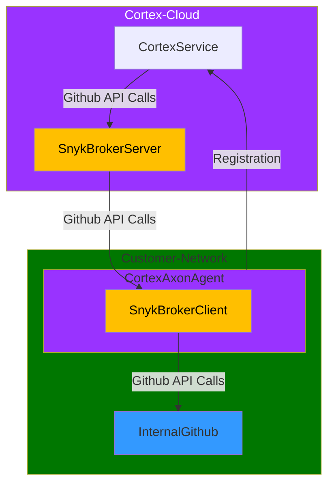

# Cortex Axon Relay

Relay allows customers to connect their internally-visible services (such as GitHub, Gitlab, Sonarqube, etc) to the cloud-hosted Cortex without opening any firewall ports.

This allows:

* Integrating data from internally-hosted services and systems
* Configuring integrations without exposing private API keys outside of the internal network

## Running Axon Relay

## Accessing internal services with Axon Relay

With Axon you can use your internal Github installation to access your internal services. The Cortex Axon agent will contact the Cortex cloud and establish a secure connection, which will be then used to route requests from there to your internal services.

### Setting up the Cortex Relay configuration 

1. Go to your Cortex [GitHub settings page](https://app.getcortexapp.com/admin/settings/github) 
2. Choose "Add Configuration", then "Relay".  Choose your alias name, for example `github-relay` or any unused name.
3. Click "Save"
4. On your machine, create a file called `.env` with the following contents, assuming you are using the public Github API:

```
CORTEX_API_TOKEN=your_cortex_token
GITHUB_TOKEN=your_github_token
```

For a GitHub App token, you'll need to set the following, using your GitHub host name:


Now you're ready to run the agent!  Create a file called `docker-compose.yml` with the following contents:

```yaml
services:
  axon:
    image: ghcr.io/cortexapps/cortex-axon-agent:latest
    env_file: .env
    env:
      - GITHUB_API=api.github.com
      - GITHUB_GRAPHQL=api.github.com/graphql
    command: [
      "relay",
      "-i", "github",
      "-a", "github-relay", # this is the alias you set up in the Cortex UI

      # if you are using a Github App token, add the following line
      # "-s", "app",
    ]
```

Note if you are using a private Github App installation (subtype `app`), you'll need to set the `GITHUB_API` and `GITHUB_GRAPHQL` to your internal Github API endpoints, for example:

```
GITHUB_API=https://github.mycompany.com/api/v3
GITHUB_GRAPHQL=https://github.mycompany.com/api/graphql
```

Now run `docker compose up` and you should see the agent start up and connect to Cortex, and be ready to handle traffic.

To test it, go to the settings page for your integration and push "Test Configurations". If you watch the logging output you should see the agent receive the request and forward it to your internal service, and the Cortex Integrations Settings page will show success.

You can see the list of built in file types [here](agent/server/snykbroker/accept_files), which will show the variables needed to execute. If an environment variable
is not found, the start will fail with an error message indicating the missing variable name.

Generally the naming works like:

* `*_API` - the root URL for the API, such as `https://api.github.com`
* `*_API` - just the host and root path for the integration such as `mycompany.github.com/api/v3`
* `*_HOST` - just the domain name, such as `mycompany.github.com`


### Environment Variables Summary

| Integration    | Environment Variables                                                                                               |
|----------------|---------------------------------------------------------------------------------------------------------------------|
| **GitHub**     | `GITHUB_API=api.github.com`, `GITHUB_GRAPHQL=api.github.com/graphql`, `GITHUB_TOKEN`                |
| **GitHub Hosted** | `GITHUB_API=https://myapp.github.com/api/v3`, `GITHUB_GRAPHQL=https://myapp.github.com/api/graphql`, `GITHUB_TOKEN` |
| **GitHub App** | Arg `-s app`, `GITHUB_API=https://api.github.com`, `GITHUB_GRAPHQL=https://api.github.com/graphql`, `GITHUB_APP_CLIENT_ID`, `GITHUB_APP_CLIENT_PEM` (either path to PEM or PEM contents), `GITHUB_INSTALLATION_ID` (optional, defaults to `GITHUB_APP_CLIENT_ID`) |
| **Prometheus** | `PROMETHEUS_API=http://mycompany.prometheus.internal`, `PROMETHEUS_USERNAME`, `PROMETHEUS_PASSWORD`                 |
| **Gitlab**     | `GITLAB_API=https://gitlab.com`, `GITLAB_TOKEN`                                                                     |
| **Sonarqube**  | `SONARQUBE_API=https://sonarqube.mycompany.com`, `SONARQUBE_TOKEN`                                                 |
| **Bitbucket Cloud**  | `BITBUCKET_API=https://api.bitbucket.org`, `BITBUCKET_TOKEN`                    |
| **Bitbucket Hosted**  | `BITBUCKET_API=https://bitbucket.mycompany.com`, `BITBUCKET_USERNAME`, `BITBUCKET_PASSWORD`                |
| **Jira**  | `JIRA_API=https://jira.mycompany.com`, `JIRA_USERNAME`, `JIRA_TOKEN`                |
| **Jira Bearer/Cloud**  | Arg `-s bearer`, `JIRA_API=https://mycompany.atlassian.com`, `JIRA_TOKEN`                |

## How it works

Internally, Cortex Axon uses an open-source project published by Snyk called [Snyk Broker](https://docs.snyk.io/enterprise-setup/snyk-broker). 

Snyk Broker is a connector that uses websockets to create a secure tunnel between the internal network and the cloud-hosted Cortex. As the tunnel is initiated from the internal network, so no firewall ports need to be opened.

The flow is based on your Cortex API key, is used to authenticate the agent and secure the connection process.

1. On the Cortex side, the integration is registered in the integration configuration settings page, with an "alias" name that you choose, such as `github-relay`.
2. The Cortex Axon Docker container is started with the your Cortex API key, the integration type (e.g. `github`), and the alias name that you chose. 
3. The Cortex Axon agent connects to the Cortex service, authenticates, and registers itself with the integration type and alias name.
4. The agent starts an instance of the `snyk-broker` (client) process and uses configuration infromatio from the `/register` call to connect to the Cortex backend instance of the `snyk-broker` server.

Once this is established, it is a robust connection that allows API calls made on the Cortex side to be relayed to the internal network, and the responses to be relayed back to the Cortex service.





### Running the agent in Kubernetes

To run the agent in Kubernetes, you'll need to create a Deployment that runs the agent with similar configuration above. There is an experimental Helm chart available [here](examples/relay/helm-chart) that you can use to get started, it's critical variables are:

```
# Example for github
relay:
  integration: github # can be blank
  subtype:   # optional, can be blank, see table above for options
  alias: alias for configuration from Cortex
  env:
    GITHUB_API: "https://api.github.com"
    GITHUB_GRAPHQL_API: "https://api.github.com/graphql"
  verbose: false # set to true to enable verbose logging
```

If you have a proxy setup you can add values like:

```
proxy:
  server:  http://proxy.example.com:8080
  noProxy: proxy.example.com # note localhost is added automatically
  certSecretName: my-proxy-ca-pem # name of the secret containing a .pem file with the CA certificate
```

## Understanding the Agent configuration

Agent configuration is driven with an `accept.json` file which defines which outbound routes the agent can call in your environment.  There are built-in files for all of the supported integrations [here](agent/server/snykbroker/accept_files), but these files are not special, you can always create your own file and pass it with the `-f` flag, for example:

```bash
docker run ... -v "/path/to/accept.json:/config/accept.json" ... cortex-axon-agent:latest relay -i github -a github-relay -f /config/accept.json
```

The file supports the following as a Hello World example:

```json
{
  // "private" means outgoing routes
  "private": [
    {
      "method": "any",
      "path": "/*",
      "origin": "https://some-server.com",
    }
  ]
}
```

This says that any traffic sent to the agent via the Snyk Broker connection will be forwarded to `https://some-server.com/*`, and the method can be any HTTP method (GET, POST, etc).

This can be differentiated by paths to select multiple outbounds:

```json
{
  "private": [
    {
      "method": "get",
      "path": "/foo/*",
      "origin": "https://foo-server.com"
    },
    {
      "method": "any",
      "path": "/bar/*",
      "origin": "https://bar-server.com"
    }
  ]
}
```

This will route any GET requests to `/foo/*` to `https://foo-server.com/foo/*`, and any other method to `/bar/*` to `https://bar-server.com/bar/*`.

For any of these routes we can add the following additional properties:

```json
{
  "private": [
    {
      "method": "get",
      "path": "/foo/*",
      "origin": "https://foo-server.com",
      "headers": {
        "my-custom-header-static": "my-custom-value",
        "my-custom-header-env": "${ENV_VAR_NAME}"
      },
      "auth": {
        "scheme": "basic", // can be "basic", "bearer"
        "username": "${USERNAME_ENV_VAR}", //basic auth only
        "password": "${PASSWORD_ENV_VAR}", //basic auth only
        "token": "${TOKEN_ENV_VAR}"  //   bearer auth only
      },
    }
  ]
}
```

Here you can see that you can add custom headers, or authentication information.  Note custom headers will override `auth` set headers, if you want to manually set `Authentication` headers this way.

### Plugins

An additional feature that Axon adds is plugins to allow dynamic header values.  Given the example above, you can do this:


```json
{
  "private": [
    {
      "method": "get",
      "path": "/foo/*",
      "origin": "https://foo-server.com",
      "headers": {
        "my-custom-header-plugin": "${plugin:my-plugin}",
        "my-custom-header-env": "${ENV_VAR_NAME}"
      },     
    }
  ]
}
```

Which requires:

1. Setting the `PLUGIN_DIRS` environment variable to a directory that contains your plugin files, such as `/plugins`
2. Creating an executable file in that directory `my-plugin`.  For each invocation of an outbound request, this plugin will be executed and its `stdout` will be used as the value for the header `my-custom-header-plugin`.

Currently plugins are ONLY supported for `headers`.