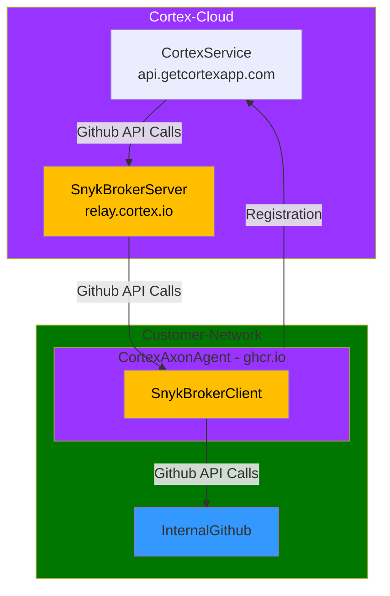

# Cortex Axon Relay

Relay allows customers to connect their internally-visible services (such as GitHub, Gitlab, Sonarqube, etc) to the cloud-hosted Cortex without opening any firewall ports.

This allows:

* Integrating data from internally-hosted services and systems
* Configuring integrations without exposing private API keys outside of the internal network

## Running Axon Relay

## Accessing internal services with Axon Relay

With Axon you can use your internal Github installation to access your internal services. The Cortex Axon agent will contact the Cortex cloud and establish a secure connection, which will be then used to route requests from there to your internal services.

### Setting up the Cortex Relay configuration 

1. Go to your Cortex [GitHub settings page](https://app.getcortexapp.com/admin/settings/github) 
2. Choose "Add Configuration", then "Relay".  Choose your alias name, for example `github-relay` or any unused name.
3. Click "Save"
4. On your machine, create a file called `.env` with the following contents, assuming you are using the public Github API:

```
CORTEX_API_TOKEN=your_cortex_token
GITHUB_TOKEN=your_github_token
```

For a GitHub App token, you'll need to set the following, using your GitHub host name:


Now you're ready to run the agent!  Create a file called `docker-compose.yml` with the following contents:

```yaml
services:
  axon:
    image: ghcr.io/cortexapps/cortex-axon-agent:latest
    env_file: .env
    env:
      - GITHUB=https://github.com
      - GITHUB_API=https://api.github.com
      - GITHUB_GRAPHQL=https://api.github.com/graphql
    command: [
      "relay",
      "-i", "github",
      "-a", "github-relay", # this is the alias you set up in the Cortex UI

      # if you are using a Github App token, add the following line
      # "-s", "app",
    ]
```

Note if you are using a private Github App installation (subtype `app`), you'll need to set the `GITHUB_API` and `GITHUB_GRAPHQL` to your internal Github API endpoints, for example:

```
GITHUB=https://github.mycompany.com
GITHUB_API=https://github.mycompany.com/api/v3
GITHUB_GRAPHQL=https://github.mycompany.com/api/graphql
```

Now run `docker compose up` and you should see the agent start up and connect to Cortex, and be ready to handle traffic.

To test it, go to the settings page for your integration and push "Test Configurations". If you watch the logging output you should see the agent receive the request and forward it to your internal service, and the Cortex Integrations Settings page will show success.

You can see the list of built in file types [here](agent/server/snykbroker/accept_files), which will show the variables needed to execute. If an environment variable
is not found, the start will fail with an error message indicating the missing variable name.

Generally the naming works like:

* `*_API` - the root URL for the API, such as `https://api.github.com`
* `*_API` - just the host and root path for the integration such as `mycompany.github.com/api/v3`
* `*_HOST` - just the domain name, such as `mycompany.github.com`


### Environment Variables Summary

| Integration           | Environment Variables                                                                                                                                                                                                                           |
|-----------------------|-------------------------------------------------------------------------------------------------------------------------------------------------------------------------------------------------------------------------------------------------|
| **GitHub**            | `GITHUB=https://github.com`, `GITHUB_API=https://api.github.com`, `GITHUB_GRAPHQL=https://api.github.com/graphql`, `GITHUB_TOKEN`                                                                                                               |
| **GitHub Hosted**     | `GITHUB=https://github.mycompany.com`, `GITHUB_API=https://github.mycompany.com/api/v3`, `GITHUB_GRAPHQL=https://github.mycompany.com/api/graphql`, `GITHUB_TOKEN`                                                                              |
| **GitHub App**        | Arg `-s app`, `GITHUB=https://github.com`, `GITHUB_API=https://api.github.com`, `GITHUB_GRAPHQL=https://api.github.com/graphql`, `GITHUB_APP_CLIENT_ID`, `GITHUB_APP_CLIENT_PEM` (either path to PEM or PEM contents), `GITHUB_INSTALLATION_ID` |
| **Prometheus**        | `PROMETHEUS_API=http://mycompany.prometheus.internal`, `PROMETHEUS_USERNAME`, `PROMETHEUS_PASSWORD`                                                                                                                                             |
| **Gitlab**            | `GITLAB_API=https://gitlab.com`, `GITLAB_TOKEN`, optional `GITLAB_USERNAME` (defaults to `oauth2`; only needed for git-over-HTTP tokens that require a specific username, e.g. deploy tokens)                                                     |
| **Sonarqube**         | `SONARQUBE_API=https://sonarqube.mycompany.com`, `SONAR_TOKEN`                                                                                                                                                                              |
| **Bitbucket Cloud**   | `BITBUCKET_API=https://api.bitbucket.org`, `BITBUCKET_TOKEN`                                                                                                                                                                                    |
| **Bitbucket Hosted**  | `BITBUCKET_API=https://bitbucket.mycompany.com`, `BITBUCKET_USERNAME`, `BITBUCKET_PASSWORD`                                                                                                                                                     |
| **Jira**              | `JIRA_API=https://jira.mycompany.com`, `JIRA_USERNAME`, `JIRA_TOKEN`                                                                                                                                                                            |
| **Jira Bearer/Cloud** | Arg `-s bearer`, `JIRA_API=https://mycompany.atlassian.com`, `JIRA_TOKEN`                                                                                                                                                                       |
| **Harness**           | `HARNESS_API=https://app.harness.io`, `HARNESS_TOKEN`                                                                                                                                                                                           |

## How it works

Internally, Cortex Axon uses an open-source project published by Snyk called [Snyk Broker](https://docs.snyk.io/enterprise-setup/snyk-broker). 

Snyk Broker is a connector that uses websockets to create a secure tunnel between the internal network and the cloud-hosted Cortex. As the tunnel is initiated from the internal network, so no firewall ports need to be opened.

The flow is based on your Cortex API key, is used to authenticate the agent and secure the connection process.

1. On the Cortex side, the integration is registered in the integration configuration settings page, with an "alias" name that you choose, such as `github-relay`.
2. The Cortex Axon Docker container is started with the your Cortex API key, the integration type (e.g. `github`), and the alias name that you chose. 
3. The Cortex Axon agent connects to the Cortex service, authenticates, and registers itself with the integration type and alias name.
4. The agent starts an instance of the `snyk-broker` (client) process and uses configuration infromatio from the `/register` call to connect to the Cortex backend instance of the `snyk-broker` server.

Once this is established, it is a robust connection that allows API calls made on the Cortex side to be relayed to the internal network, and the responses to be relayed back to the Cortex service.



```mermaid
graph TD
   
    CortexAxonAgent -->|Registration| CortexService

    SnykBrokerServer -->|Github API Calls|SnykBrokerClient
    SnykBrokerClient -->|Github API Calls|InternalGithub
    CortexService -->|Github API Calls|SnykBrokerServer

    subgraph Cortex-Cloud
        CortexService["CortexService<br/>api.getcortexapp.com"]           
        SnykBrokerServer["SnykBrokerServer<br/>relay.cortex.io"]
    end

    subgraph Customer-Network
        subgraph CortexAxonAgent["CortexAxonAgent - ghcr.io"]
            SnykBrokerClient
        end
        InternalGithub
    end

    style Cortex-Cloud fill:#93f, color:white
    style CortexAxonAgent fill:#93f
    style Customer-Network fill:#070
    style SnykBrokerServer fill:#ffbf00,color:black
    style SnykBrokerClient fill:#ffbf00,color:black
    style InternalGithub fill:#39f
```


### Running the agent in Kubernetes

To run the agent in Kubernetes, you'll need to create a Deployment that runs the agent with similar configuration above. There is an experimental Helm chart available [here](examples/relay/helm-chart) that you can use to get started, it's critical variables are:

```
# Example for github
relay:
  integration: github # can be blank
  subtype:   # optional, can be blank, see table above for options
  alias: alias for configuration from Cortex
  env:
    GITHUB: "https://github.com"
    GITHUB_API: "https://api.github.com"
    GITHUB_GRAPHQL_API: "https://api.github.com/graphql"
  verbose: false # set to true to enable verbose logging
```

If you have a proxy setup you can add values like:

```
proxy:
  server:  http://proxy.example.com:8080
  noProxy: proxy.example.com # note localhost is added automatically
  certSecretName: my-proxy-ca-pem # name of the secret containing a .pem file with the CA certificate
```

## Required Outbound Connections

  You must allow outbound HTTPS (port 443) to:

  | Endpoint | Purpose |
  |----------|---------|
  | `api.getcortexapp.com` | CortexService - Agent registration and API calls |
  | `relay.cortex.io` | SnykBrokerServer - WebSocket tunnel for relayed requests |

  No inbound firewall ports need to be opened - the agent initiates all outbound connections.

  Your docker or kubernetes instance will also need to reach ghcr.io in order to pull the agent docker image.

## Understanding the Agent configuration

Agent configuration is driven with an `accept.json` file which defines which outbound routes the agent can call in your environment.  There are built-in files for all of the supported integrations [here](agent/server/snykbroker/accept_files), but these files are not special, you can always create your own file and pass it with the `-f` flag, for example:

```bash
docker run ... -v "/path/to/accept.json:/config/accept.json" ... cortex-axon-agent:latest relay -i github -a github-relay -f /config/accept.json
```

The file supports the following as a Hello World example:

```json
{
  // "private" means outgoing routes
  "private": [
    {
      "method": "any",
      "path": "/*",
      "origin": "https://some-server.com",
    }
  ]
}
```

This says that any traffic sent to the agent via the Snyk Broker connection will be forwarded to `https://some-server.com/*`, and the method can be any HTTP method (GET, POST, etc).

This can be differentiated by paths to select multiple outbounds:

```json
{
  "private": [
    {
      "method": "get",
      "path": "/foo/*",
      "origin": "https://foo-server.com"
    },
    {
      "method": "any",
      "path": "/bar/*",
      "origin": "https://bar-server.com"
    }
  ]
}
```

This will route any GET requests to `/foo/*` to `https://foo-server.com/foo/*`, and any other method to `/bar/*` to `https://bar-server.com/bar/*`.

For any of these routes we can add the following additional properties:

```json
{
  "private": [
    {
      "method": "get",
      "path": "/foo/*",
      "origin": "https://foo-server.com",
      "headers": {
        "my-custom-header-static": "my-custom-value",
        "my-custom-header-env": "${ENV_VAR_NAME}"
      },
      "auth": {
        "scheme": "basic", // can be "basic", "bearer"
        "username": "${USERNAME_ENV_VAR}", //basic auth only
        "password": "${PASSWORD_ENV_VAR}", //basic auth only
        "token": "${TOKEN_ENV_VAR}"  //   bearer auth only
      },
    }
  ]
}
```

Here you can see that you can add custom headers, or authentication information.  Note custom headers will override `auth` set headers, if you want to manually set `Authentication` headers this way.

### Plugins

An additional feature that Axon adds is plugins to allow dynamic header values.  Given the example above, you can do this:


```json
{
  "private": [
    {
      "method": "get",
      "path": "/foo/*",
      "origin": "https://foo-server.com",
      "headers": {
        "my-custom-header-plugin": "${plugin:my-plugin}",
        "my-custom-header-env": "${ENV_VAR_NAME}"
      },     
    }
  ]
}
```

Which requires:

1. Setting the `PLUGIN_DIRS` environment variable to a directory that contains your plugin files, such as `/plugins`
2. Creating an executable file in that directory `my-plugin`.  For each invocation of an outbound request, this plugin will be executed and its `stdout` will be used as the value for the header `my-custom-header-plugin`.

Currently plugins are ONLY supported for `headers`.

### Credential plugins shipped with the agent

Some plugins ship in the image, in `/agent/plugins` alongside the ones you can
add. They are ordinary plugins - referenced the same way, found by name in
`PLUGIN_DIRS`, executed per request - and are only distinguished by being built
and installed for you.

`google-adc` keeps a token cache in a file, which is what makes a per-request
subprocess affordable: a token the issuer intends to be reused is minted about two
dozen times a day rather than on every request. The cache is keyed on the
credential configuration, so rotating it does not keep serving the previous
identity, and it is owner-readable only.

```json
{
  "private": [
    {
      "method": "any",
      "path": "/*",
      "origin": "https://*.googleapis.com",
      "headers": {
        "authorization": "${plugin:google-adc}"
      }
    }
  ]
}
```

| Name | Produces |
| -- | -- |
| `google-adc` | An `Authorization` header value from Google Application Default Credentials |

If the plugin cannot produce a value, the agent forwards the request with the
placeholder unexpanded and the upstream answers `401`, which is indistinguishable
from a credential Google refused. Check the plugin directly to tell the two apart -
see below.

## Google APIs

The `google` integration reaches Google APIs with a credential the agent obtains
in your network. Cortex holds no Google credential, and no Google access token
ever travels to Cortex.

```bash
docker run ... cortex-axon-agent:latest relay -i google -a google-relay
```

The shipped accept file authorizes one host family:

```json
"origin": "${GOOGLE_API:https://*.googleapis.com}"
```

Every Google API Cortex calls resolves to a hostname exactly one label under
`googleapis.com`, so one rule covers all of them. A wildcard matches exactly one
label: `storage.googleapis.com` matches, `foo.storage.googleapis.com` does not.

### Overriding the destination

Two ways, in increasing order of control:

1. Set `GOOGLE_API` to a different origin. It must still be a single-label
   wildcard over a registrable domain, or a concrete host.
2. Supply a whole accept file with `-f`, as with any other integration. Keep the
   `${plugin:google-adc}` header if you still want the agent to inject the
   credential.

A wildcard origin requires verified upstream TLS. Setting `DISABLE_TLS` with a
wildcard origin is refused at startup, because with verification off anything
answering the connection can claim the authorized name, and the origin would then
authorize nothing.

### Identity and permissions

The agent uses Application Default Credentials, so it works with whatever
identity mechanism you already run - GKE Workload Identity, workload identity
federation, or a mounted credential configuration. Cortex does not need to know
which.

The initial provider requests the `cloud-platform` scope. This is deliberately
broader than the calls Cortex makes, and **your IAM bindings are the permission
boundary**. The accept file decides which hosts the agent may reach; your IAM
decides what the identity may do once it gets there.

Axon does not carry a second list of permitted Google services. Such a list would
look authoritative while sitting on the wrong side of that boundary - Cortex
asserting what your identity may do, while your IAM is what actually decides -
and two policies that disagree fail in the direction of whoever forgot to update
the second one. Grant least privilege in IAM; see the least-privilege IAM matrix
in the deployment handover package.

The consequence to be aware of: anyone holding a valid relay token can reach any
Google API the deployed accept file authorizes, bounded by that identity's IAM
permissions. They cannot extract the Google token itself, which never leaves the
agent's pod.

The access token is cached in a file so it can be reused across requests and
across agent restarts. It is written owner-readable only, under the process
temporary directory by default, and holds one access token - never the credential
configuration it was minted from. Set `AXON_CREDENTIAL_CACHE_DIR` to move it, for
example onto a volume you already control.

### Checking the credential without a relay

The credential source is a binary, so it can be exercised on its own. None of this
needs a relay token, a tunnel, or anything running in Cortex.

Does this machine have a credential configuration at all? This mints nothing, so
it is safe to run against a live deployment:

```bash
/agent/plugins/google-adc -probe
```

Does the credential work against a real Google API?

```bash
AUTH=$(/agent/plugins/google-adc)
curl -sS -o /dev/null -w '%{http_code}\n' \
  -H "Authorization: $AUTH" \
  https://cloudresourcemanager.googleapis.com/v1/projects
```

`401` means Google refused the credential. `403` means it accepted the identity
and refused the call, which is an IAM binding or a disabled API, not a credential
problem.

Run it a second time and the token comes from the cache rather than a new
exchange. The cache file's modification time is the way to tell.

#### Inside the container

The container has no credentials of its own. On GCE or GKE it reaches the metadata
server and there is nothing to do. Anywhere else, bring a credential in:

```bash
docker run --rm \
  -v ~/.config/gcloud/application_default_credentials.json:/adc.json:ro \
  -e GOOGLE_APPLICATION_CREDENTIALS=/adc.json \
  cortex-axon-agent:latest /agent/plugins/google-adc -probe
```

The same mount works for a service account key or a workload identity federation
configuration, because all three are Application Default Credentials.

The token cache lives under the container's temporary directory, so it survives
the agent restarting inside a container but not the container being replaced. To
keep it across replacements, mount a directory and set
`AXON_CREDENTIAL_CACHE_DIR` to it. Nothing breaks without that - the first request
after a replacement mints again.

### Network requirements

- The relayed Google API traffic goes out through the accept file's origin.
- Application Default Credentials needs its own egress, which does **not** use
  the relayed path: metadata-server access on GKE, or `sts.googleapis.com` and
  `iamcredentials.googleapis.com` for workload identity federation.

### A note on the routing header

The agent removes its internal routing header on every path before forwarding.
The safety of that does not rest on Google declining to return it: at least one
Google service reflects arbitrary request header *names* in a CORS preflight
response. The control is the agent removing the header, not the upstream choosing
not to echo it.
